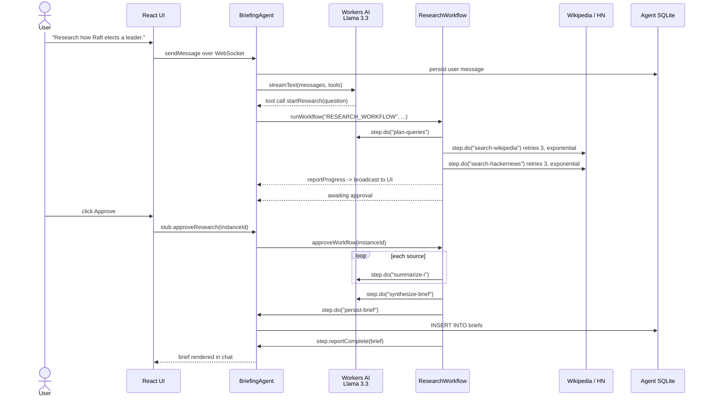

# Research Briefing Agent

An AI agent on Cloudflare that turns a research question into a short, cited brief. It plans
sub-queries with Llama 3.3, runs a durable Cloudflare Workflow that fetches real sources from
Wikipedia and Hacker News, pauses for you to approve those sources, then summarizes each one and
synthesizes the brief. Every brief is stored in the agent's own SQLite database, so the
conversation and its results survive a page refresh.

**Live URL:** https://research-briefing-agent.rajavarapu-avinash.workers.dev

No API keys are required. Workers AI is reached through the `ai` binding, and both research
sources are keyless public APIs, so setup is `npm install && npm run deploy`.

## Architecture

Each requirement maps to exactly one Cloudflare primitive.

| Requirement | Cloudflare primitive | File |
|---|---|---|
| LLM | Workers AI `@cf/meta/llama-3.3-70b-instruct-fp8-fast` via `workers-ai-provider` | [`src/server.ts`](src/server.ts), [`src/workflows/research.ts`](src/workflows/research.ts) |
| Workflow / coordination | Cloudflare Workflow started by the Agent — `ResearchWorkflow extends AgentWorkflow`, bound as `RESEARCH_WORKFLOW` | [`src/workflows/research.ts`](src/workflows/research.ts), [`wrangler.jsonc`](wrangler.jsonc) |
| User input | React chat over WebSocket (`useAgent` + `useAgentChat`), plus optional browser voice input | [`src/app.tsx`](src/app.tsx), [`src/VoiceButton.tsx`](src/VoiceButton.tsx) |
| Memory / state | `AIChatAgent` message persistence in per-instance SQLite, a `briefs` table via `this.sql`, and light broadcast state via `setState` | [`src/server.ts`](src/server.ts) |

Supporting files:

| File | Role |
|---|---|
| [`src/sources.ts`](src/sources.ts) | Keyless Wikipedia and Hacker News fetchers. Hosts are hardcoded constants — the SSRF boundary |
| [`src/ai-binding.ts`](src/ai-binding.ts) | Works around a `workers-ai-provider` bug that doubles every streamed token and corrupts tool-call arguments |
| [`src/ResearchPanel.tsx`](src/ResearchPanel.tsx) | Live workflow progress and the approve / reject controls |
| [`tests/`](tests) | Vitest via `@cloudflare/vitest-pool-workers`, running inside `workerd` |

### One user turn



Design notes and rejected alternatives are in [`docs/architecture.md`](docs/architecture.md).

## What the workflow actually does

The coordination requirement is not one model call in a wrapper. `ResearchWorkflow` runs several
`step.do` calls with genuinely different failure modes and retry policies:

| Step | Fails on | Retries |
|---|---|---|
| `plan-queries` | Model error or schema violation | 2, exponential from 2s |
| `search-wikipedia` | Network, 429, 5xx, timeout | 3, exponential from 5s, 30s timeout |
| `search-hackernews` | Network, 429, 5xx, timeout | 3, exponential from 5s, 30s timeout |
| `summarize-<i>` | Model error, one call per source | 2, exponential from 2s |
| `synthesize-brief` | Model error | 2, exponential from 2s |
| `persist-brief` | Agent RPC / SQLite write | default |

Between the searches and the summaries the workflow calls `waitForApproval`. That wait is
durable: it survives Durable Object eviction and a browser refresh, which is the thing a single
Worker request genuinely cannot do.

Inspect a run after deploying:

```bash
npx wrangler workflows instances describe research-workflow latest
```

## Memory

Two layers, split by what they cost to broadcast:

- **Broadcast state** (`setState`) holds only small, changing UI facts — status, active workflow
  id, current step, percent, brief count. Every write is pushed to connected clients.
- **SQLite** (`this.sql`) holds the `briefs` table and, via `AIChatAgent`, the message history.
  Brief bodies never enter broadcast state.

A `recallBriefs` tool lets the model search past briefs, so follow-up questions build on earlier
research instead of starting cold. History is windowed with `pruneMessages` and
`maxPersistedMessages = 100` to stay inside Llama 3.3's 24k-token context.

## Run locally

```bash
npm install
npm run dev          # http://localhost:5173
```

`npm run dev` requires a Cloudflare login, because the `ai` binding is `remote: true` — Workers AI
has no local emulation. Wrangler prompts on first run. The account also needs a `workers.dev`
subdomain, which is created simply by opening the Workers & Pages dashboard page once.

## Deploy

```bash
npm run deploy
```

## Tests

```bash
npx vitest run       # 29 tests
```

Tests execute inside `workerd`, so bindings and SQLite behave as in production. They cover the
claims this project rests on:

| Test file | Proves |
|---|---|
| `tests/memory.test.ts` | A brief written through one agent stub is visible from a fresh stub for the same name, state updates alongside the SQL write, and instances stay isolated |
| `tests/sources.test.ts` | The fetchers throw on 429 and 5xx — which is what makes a workflow step retry instead of failing the run — and the query is encoded rather than interpolated |
| `tests/select-sources.test.ts` | Irrelevant results are dropped and providers are balanced |
| `tests/ai-binding.test.ts` | Duplicate text deltas and duplicate tool calls are removed, while models reporting text only via `response` keep working |
| `tests/bindings.test.ts` | The AI, agent, and workflow bindings resolve and routing behaves |

Full gate:

```bash
npx wrangler types env.d.ts && npx tsc --noEmit && npx vitest run
```

## A note on the LLM layer

`workers-ai-provider@3.3.1` reads each Workers AI SSE chunk twice — once from the legacy
top-level fields and again from `choices[0].delta`. Workers AI populates both, so text arrived
doubled (`"A Cloud A Cloudflare Durableflare Durable..."`) and tool-call arguments concatenated
into invalid JSON, which made every tool call fail with an unhelpful error. The upstream fix is
in v4, which requires `ai@7`, but `@cloudflare/ai-chat` pins `ai@6`.
[`src/ai-binding.ts`](src/ai-binding.ts) drops the redundant top-level copy at the SSE layer, and
only when an exact duplicate is present, so single-source models still work.
