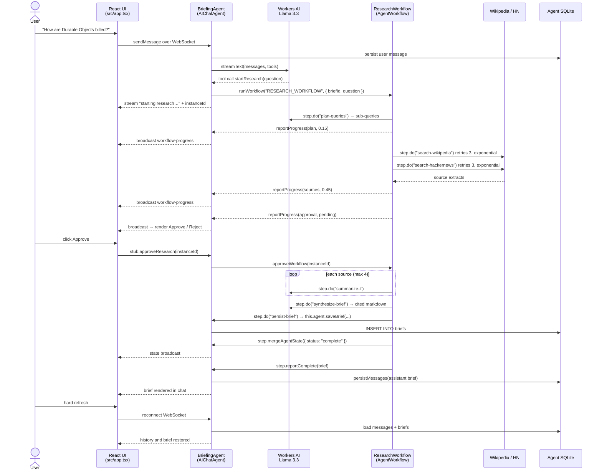

# Architecture — Research Briefing Agent

## Problem

Answering a real research question is not one model call. It requires deciding what to look up,
actually retrieving external material, reading each source, and only then writing something
worth keeping — and the retrieval step fails in ways a chat request cannot absorb, because
public APIs rate-limit, time out, and return malformed payloads. A single Worker request that
tries to do all of that either blocks the user for thirty seconds or loses everything when one
fetch fails. This project splits the work correctly: a chat agent owns the conversation and the
memory, and a Cloudflare Workflow owns the durable multi-step research, retrying failed fetches,
pausing for the user's approval before spending tokens on synthesis, and streaming its progress
back to the browser. The user asks a question in chat, watches the pipeline run, approves the
sources, and gets a cited brief that is still there after a page refresh.

## Component map

Every requirement resolves to exactly one Cloudflare primitive. This table is frozen; changing a
row means re-running the `plan` phase.

| Requirement | Cloudflare primitive | File that implements it |
|---|---|---|
| LLM | Workers AI `@cf/meta/llama-3.3-70b-instruct-fp8-fast` via the `ai` binding, called through `workers-ai-provider` | `src/server.ts` (chat turn), `src/workflows/research.ts` (plan, summarize, synthesize) |
| Workflow / coordination | Cloudflare Workflow started by the Agent — `ResearchWorkflow extends AgentWorkflow`, bound as `RESEARCH_WORKFLOW` | `src/workflows/research.ts`, `wrangler.jsonc` |
| User input | React chat UI over WebSocket via `useAgent` + `useAgentChat`, with optional browser speech input | `src/app.tsx` |
| Memory / state | `AIChatAgent` message persistence in per-instance SQLite, plus a `briefs` table via `this.sql` and light broadcast state via `setState` | `src/server.ts` |

Supporting files:

| File | Role |
|---|---|
| `src/sources.ts` | Keyless source fetchers (Wikipedia, Hacker News). Hardcoded hosts — the SSRF boundary |
| `wrangler.jsonc` | `ai` binding, `BriefingAgent` Durable Object binding, `new_sqlite_classes` migration, `workflows` entry |
| `tests/` | Vitest with `@cloudflare/vitest-pool-workers`; proves state persistence and workflow retry |

## Sequence

One full user turn, from chat input through the workflow to the state write.

## Rejected alternatives

| Considered | Why not |
|---|---|
| **Incident triage agent** (scored one point higher on the rubric) | Its only non-LLM step is a local SQL dedupe query, which never fails on its own. Demonstrating the Workflow's retry behaviour would have required injecting an artificial fault — exactly the "checkbox compliance" reading the assignment warns about. The research agent has a genuine network step that rate-limits and times out for real. |
| **Trip planner** | Every workflow step is a model call, so the Workflow degenerates into a prompt chain. Scored 3 on "genuinely multi-step". |
| **AI SDK tool `needsApproval` for the approval gate** | It pauses the chat turn, not the background work, so it dies with the isolate. `waitForApproval` on the Workflow is durable across eviction and survives a browser refresh, which is the coordination capability a single request genuinely cannot provide. Both mechanisms exist; using the workflow-level one is the point. |
| **Search APIs requiring a key** (Tavily, Serper, Brave, Bing) | Breaks the "reviewer runs `npm install && npm run deploy`" constraint and forces secret handling. Wikipedia and Hacker News Algolia are keyless and need no account. |
| **Browser Rendering / real web scraping** | Requires a paid plan and adds a slow, flaky dependency to a two-minute demo. |
| **Vectorize + RAG over stored briefs** | The memory requirement is already satisfied by SQLite, and embedding infrastructure adds a binding and an indexing pipeline that no requirement asks for. Recall is a `SELECT`. |
| **Storing chat history in React state** | Named explicitly as an anti-pattern: it breaks on refresh and leaves the memory requirement unmet. History lives in the agent's SQLite. |
| **Server-side voice pipeline (STT → LLM → TTS over WebSocket)** | Chat already satisfies the input requirement. Browser `SpeechRecognition` reuses the existing chat path for roughly twenty lines instead of a second streaming pipeline. |
| **Separate Pages deployment for the UI** | A split origin means the agent WebSocket needs CORS configuration for no benefit. The Vite plugin ships the UI and the Worker in one deployment. |
| **Plain `WorkflowEntrypoint`** | It has no typed RPC back to the originating Agent, so progress reporting and the state write would need hand-rolled routing. `AgentWorkflow` provides `this.agent`, `reportProgress`, and `step.mergeAgentState`. |
